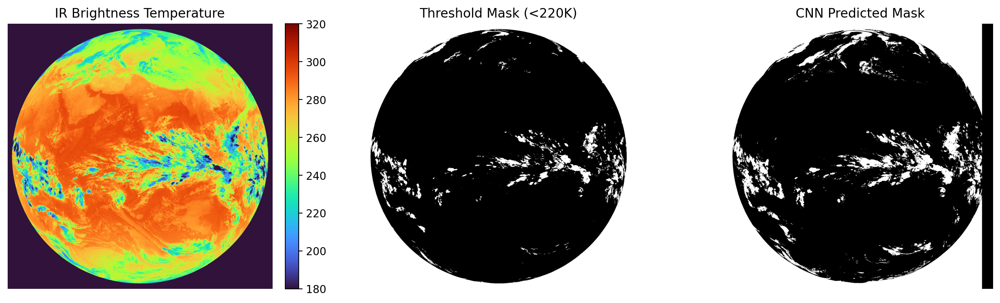
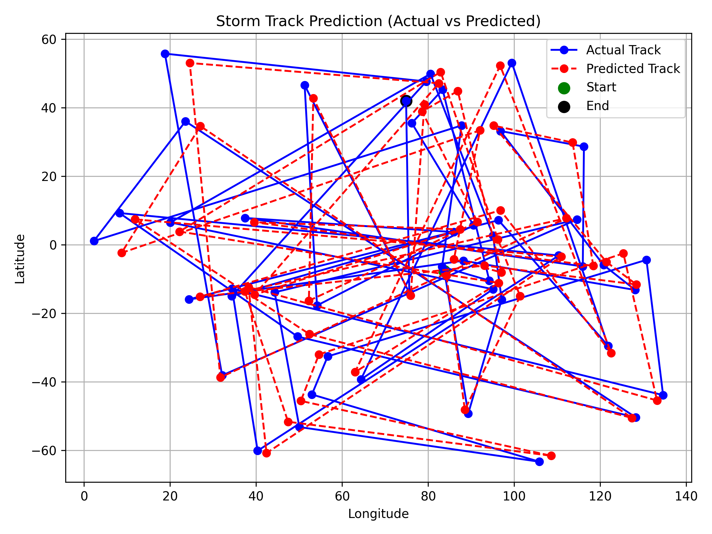
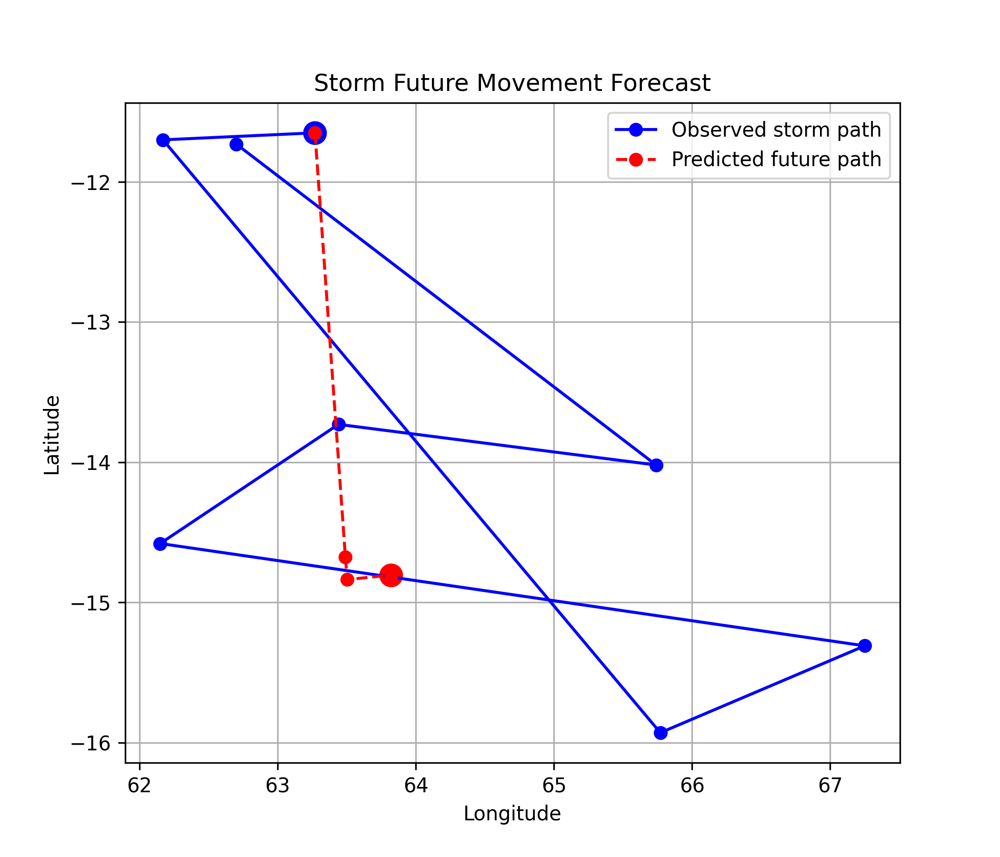

# 🌩️ Tropical Cloud Cluster Detection & Storm Prediction using INSAT Satellite Data

---

## 📌 Overview

This project presents an **end-to-end AI/ML pipeline** for detecting and predicting **Tropical Cloud Clusters (TCCs)** using INSAT-3D satellite infrared data.

It combines:

* **Computer Vision (CNN / U-Net)** for cloud detection
* **Clustering & Tracking algorithms** for storm movement
* **Time-Series Models (LSTM / GRU)** for future prediction

The system processes raw satellite data and produces **storm trajectories and future forecasts**.

---

## 🎯 Objectives

* Detect cloud regions from satellite infrared brightness temperature
* Identify and track cloud clusters over time
* Analyze storm lifecycle (formation → growth → dissipation)
* Predict future storm paths using deep learning models

---

## 🛰️ Dataset

* **Source**: INSAT-3D Satellite
* **Input Format**: `.npz` files
* **Key Feature**: TIR1 Brightness Temperature (TIR1_TEMP)
* **Temporal Resolution**: ~30 minutes per frame

---

## ⚙️ System Pipeline

```text
Raw INSAT NPZ Data
        ↓
CNN Dataset Creation (Patch Extraction)
        ↓
CNN Model (U-Net) → Cloud Mask Prediction
        ↓
Cluster Detection
        ↓
Storm Tracking
        ↓
Sequence Generation
        ↓
LSTM / GRU Training
        ↓
Future Storm Prediction
```

---

## 🧠 Models Used

### 🔹 CNN (U-Net)

* Input: 128×128 satellite image patches
* Output: Cloud segmentation masks
* Preprocessing:

  * Temperature normalization
  * Noise reduction (Gaussian smoothing)
* Performance:

  * IoU ≈ **0.78**

---

### 🔹 LSTM / GRU Models

* Input: Time-series of storm cluster features
* Output: Future storm trajectory prediction
* Used for capturing **temporal dynamics of cloud systems**

---

## 📂 Project Structure

```text
project/
├── data/              # datasets (raw, cnn, lstm, masks, tracks)
├── models/            # trained CNN and sequence models
├── src/               # core pipeline modules
├── outputs/           # generated images and plots
├── scripts/           # helper utilities
├── main_pipeline.py   # end-to-end execution
└── requirements.txt
```

---

## 🖼️ Results & Visualizations

### 🔹 Cloud Detection



### 🔹 Storm Tracking



### 🔹 Future Prediction



---

## 📊 Key Results

* Accurate cloud segmentation using CNN
* Reliable storm tracking across time frames
* Future storm path prediction using sequence models
* End-to-end pipeline from raw data to prediction

---

## 🛠️ Tech Stack

* **Programming Language**: Python
* **Deep Learning**: TensorFlow / Keras
* **Data Processing**: NumPy, Pandas
* **Scientific Computing**: SciPy
* **Machine Learning Utilities**: Scikit-learn, Joblib
* **Visualization**: Matplotlib
* **Utilities**: tqdm

---

## ▶️ How to Run

### 1️⃣ Clone the Repository

```bash
git clone <your-repo-link>
cd project
```

### 2️⃣ Install Dependencies

```bash
pip install -r requirements.txt
```

### 3️⃣ Run Full Pipeline

```bash
python main_pipeline.py
```

---

## 🚀 Future Improvements

* ConvLSTM for spatio-temporal modeling
* Real-time storm monitoring system
* Web-based visualization dashboard
* Integration with meteorological APIs
* Deployment using Docker

---

## 💡 Key Highlights

* End-to-end machine learning pipeline
* Combines **Computer Vision + Time Series Modeling**
* Works on real-world satellite data
* Scalable and research-oriented architecture

---

## 🎤 Interview Insight

> This project demonstrates how deep learning can be applied to satellite imagery for real-world weather forecasting by integrating CNN-based segmentation with sequence prediction models like LSTM and GRU.

---

## 👨‍💻 Author

**Pavan Kumar**

---

## ⭐ Acknowledgment

* INSAT Satellite Data
* Open-source ML libraries
* Research inspiration from meteorological studies

---
